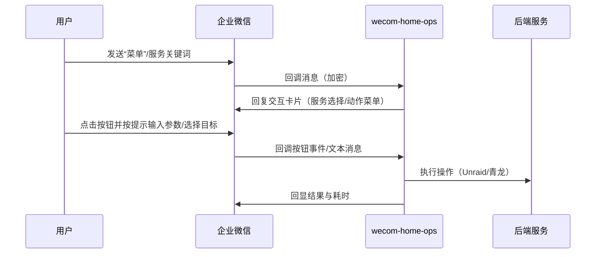

# 架构设计

## 总体架构

```mermaid
flowchart TD
    U[用户（企业微信应用会话）] -->|消息/事件回调| W[企业微信服务端]
    W -->|回调URL| S[wecom-home-ops 服务]
    S --> R[core.Router]
    R --> PU[Provider: Unraid]
    R --> PQ[Provider: 青龙(QL)]
    PU --> U0[Unraid]
    U0 -->|容器管理| D[Docker]
    PQ --> Q0[青龙面板]
    Q0 -->|任务管理| T[定时任务/脚本执行]
```

## 技术栈
- **后端:** Go（`net/http`）
- **数据:** MVP 默认内存会话状态 + 文件日志（可选扩展 SQLite）
- **部署:** 本地服务器/NAS/Docker（需公网 HTTPS 或可被企业微信访问的回调地址）
- **Unraid:** Unraid Connect 插件 GraphQL API（`/graphql` + `x-api-key`）
- **青龙:** 青龙 OpenAPI（`/open/*`，Bearer token）

## 核心流程



## 重大架构决策
完整的 ADR 存储在各变更的 how.md 中，本章节提供索引。

| adr_id | title | date | status | affected_modules | details |
|--------|-------|------|--------|------------------|---------|
| ADR-001 | 单体服务 + 适配器插件化 | 2026-01-12 | ✅已采纳 | core,wecom,unraid | [how.md](../history/2026-01/202601120816_wecom_unraid/how.md) |
| ADR-002 | MVP 默认“内存会话状态 + 日志审计” | 2026-01-12 | ✅已采纳 | core | [how.md](../history/2026-01/202601120816_wecom_unraid/how.md) |
| ADR-003 | 引入 Provider 插件框架 | 2026-01-12 | ✅已采纳 | core,wecom,unraid,qinglong | [how.md](../history/2026-01/202601121219_wecom_service_framework/how.md) |
